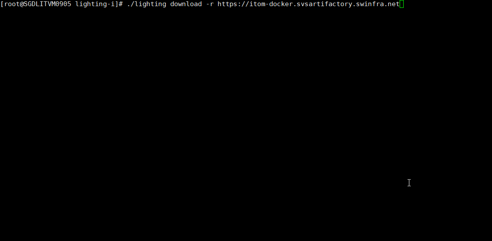
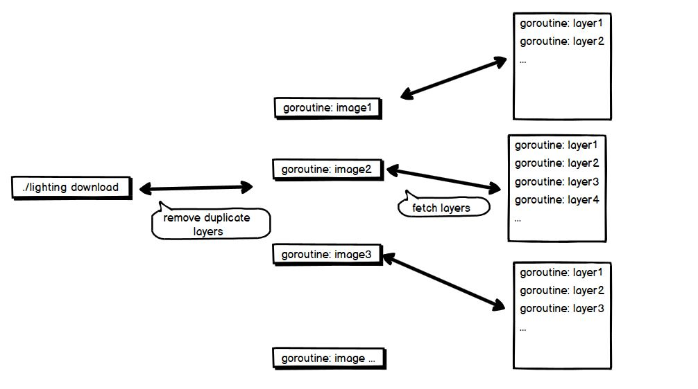

# lighting-i
**lighting** is used to bulk download or upload docker images. It's much faster than 'docker pull'.


## Flow


## Usage
### Download images
```sh
./lighting download -r <image repository URL> -u <username> -p <password> -d <custom image path>
```

- `username` and `password` are the Docker registry credentials.
- `-r` and `-d` options are optional. Specify the `-r` option if you want to download the suite images from 
a repository other than Docker Hub. Specify the `-d` option if you want to download the images to a custom image path 
rather than the default directory on the download machine.
- `-i` option is optional, specify the images set file path. default is `/var/opt/lighting/image_set.yaml`.

### Upload images
```sh
./lighting upload -r <image repository URL> -u <username> -p <password> -d <custom image path>
```

- `username` and `password` are the Docker registry credentials.
- Specify the `-r` option if you want to download the suite images from a repository other than Docker Hub. 
- Specify the `-d` option, **`custom image path` must have the same value that you defined for 
the `./lighting download` command**.

### Images set file
```yaml
org_name: "shipengqi" # required
version: "0.0.1"      # optional
images:
  - gdx-office:1.0.0
  - example1:1.0.2
  - example2:1.0.2
  - example3:1.0.2
  - example4:1.0.2
```

## Build
```sh
make

# help
make help
```